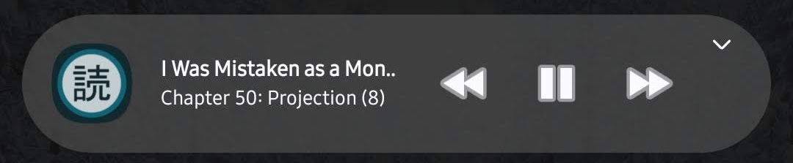
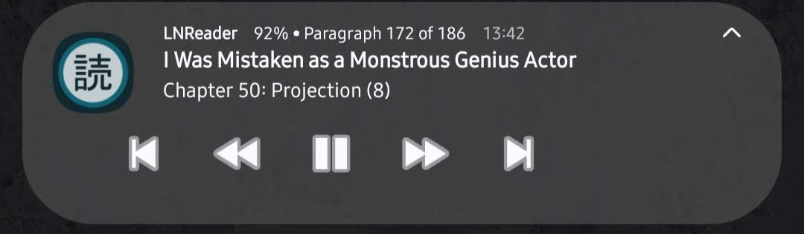
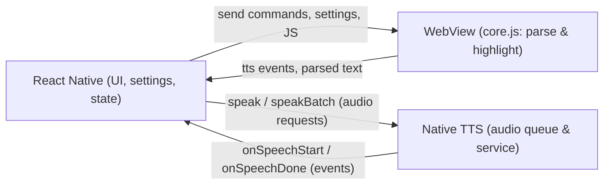

<p align="center">
  <a href="https://lnreader.app">
    
  </a>
</p>

<h1 align="center">LNReader</h1>

<p align="center">
  LNReader is a free and open source light novel reader for Android, inspired by Tachiyomi.
</p>

<div align="center">
  <a href="https://github.com/bizzkoot/lnreader/releases">
    
  </a>
</div>

<div align="center">
  <a href="https://github.com/bizzkoot/lnreader/blob/main/LICENSE">
    
  </a>
  <a title="Crowdin" target="_blank" href="https://crowdin.com/project/lnreader">
    
  </a>
</div>

<h2 align="center">Download</h2>

<p align="center">
  <a href="https://github.com/bizzkoot/lnreader/releases/latest">
    
  </a>
  
</p>

<p align="center">
  Get the app from our <a href="https://github.com/bizzkoot/lnreader/releases">releases page</a>.
</p>

<p align="center">
  <em>Android 7.0 or higher.</em>
</p>

**Table of Contents**

- [Screenshots](#screenshots)
- [What's New](#whats-new)
- [TTS Feature Demo](#tts-feature-demo)
- [Key TTS Features Showcase](#key-tts-features-showcase)
- [TTS Feature Highlights](#tts-feature-highlights)
- [Enhanced TTS Media Notification (Android)](#enhanced-tts-media-notification-android)
- [Architecture](#architecture)
- [Plugins](#plugins)
- [Building & Contributing](#building--contributing)
- [License](#license)

<h2 align="center">Screenshots</h2>

<p align="center">
  
</p>

## What's New

### TTS Feature Highlights

| Feature                       | Description                                                   | Status                    |
| ----------------------------- | ------------------------------------------------------------- | ------------------------- |
| 🎯 **Draggable Button**       | TTS controls remember position across sessions                | ✅ Implemented            |
| 🔊 **Background Playback**    | Continue listening with screen off or app in background       | ✅ Android 14+ Compatible |
| 📖 **Auto-scroll Sync**       | Text follows audio playback in real-time                      | ✅ Enhanced               |
| 🎵 **Voice Management**       | Human-readable voice names and model sanitization             | ✅ Improved               |
| 🔤 **Highlight Paragraph**    | Visually highlights the active paragraph while reading        | ✅ Implemented            |
| 📥 **Auto Chapter Download**  | Auto-download next chapters when queue gets low to avoid gaps | ✅ Implemented            |
| 🎚️ **Speed & Pitch Controls** | Fine-grained voice speed and pitch settings                   | ✅ Available              |
| ⚡ **Auto Resume**            | Automatically resume playback after interruptions             | ✅ Added                  |
| 🔄 **Direct Updates**         | Bottom panel updates instantly with new settings              | ✅ Optimized              |
| 🎶 **Media Notification**     | 5-button MediaStyle notification (Prev, -5, Play/Pause, +5, Next) with rich metadata and native TTS progress sync | ✅ Implemented |
| 📏 **UI-wide Scaling**       | UI-wide layout scaling via `uiScale` setting (scales icons, paddings, and component dimensions) | ✅ Implemented            |

## TTS Feature Demo

<h3 align="center">🎵 Text-to-Speech in Action</h3>

<p align="center">

[TTS-Dragable_Bottom Panel_Direct Update.webm](https://github.com/user-attachments/assets/94fad773-f63d-4a43-ac6d-53f62421e14a)

</p>

<p align="center">
  <em>Experience the new draggable TTS bottom panel with direct update functionality</em>
</p>

### Key TTS Features Showcase

#### 🎛️ Interactive Controls & Features

<div align="center">

| <div align="center"><br><strong>Bottom Panel Settings</strong><br>Customize TTS controls and behavior.</div>                      | <div align="center"><br><strong>Voice Model Management</strong><br>Sanitize and organize voice options with human-readable names.</div> | <div align="center"><br><strong>Auto-scrolling</strong><br>Text follows TTS playback automatically for an immersive reading experience.</div> |
| ------------------------------------------------------------------------------------------------------------------------------------------------------------------------------------------------------------------------------------------------- | ------------------------------------------------------------------------------------------------------------------------------------------------------------------------------------------------------------------------------------------------------ | -------------------------------------------------------------------------------------------------------------------------------------------------------------------------------------------------------------------------------------------------------------- |
| <div align="center"><br><strong>Auto Chapter Download</strong><br>Seamless chapter fetching during reading to avoid interruptions.</div> | <div align="center"><br><strong>TTS Settings Interface</strong><br>Comprehensive settings panel with auto-resume, scroll sync, and more.</div> | <div align="center"><br><strong>UI Scaling</strong><br>UI-wide scaling demo.</div> |

</div>

## Enhanced TTS Media Notification (Android)

This release introduces a 5-button Android MediaStyle notification for the TTS foreground service. It provides rich metadata (novel name, chapter title, and paragraph-based progress), lock-screen visibility, and a native ⇄ React Native TTS progress sync — all while preserving visibility of the 5 action buttons.

<div align="center">
  <figure style="display:block; margin:0 auto; text-align:center; width:360px;">
    
    <figcaption style="font-size:14px; color:#666;">Compact notification layout with controls</figcaption>
  </figure>
  <figure style="display:block; margin:16px auto 0; text-align:center; width:360px;">
    
    <figcaption style="font-size:14px; color:#666;">Expanded notification with title, chapter and paragraph progress</figcaption>
  </figure>
</div>

**Key features**

- 5 media action buttons: `Previous` (chapter), `-5` (rewind paragraphs), `Play/Pause`, `+5` (forward paragraphs), `Next` (chapter), plus a `Stop` action.
- Paragraph-based progress text displayed as "x% • Paragraph y of z".
- Lock-screen visibility using `NotificationCompat.VISIBILITY_PUBLIC`.
- TTS progress sync: Native saves playback position to SharedPreferences (`tts_progress`) and React Native falls back to this native position using `TTSHighlightModule.getSavedTTSPosition()` when loading chapters.
- Centralized save logic in `TTSForegroundService` ensures position persists on pause/stop/destroy.

**Button mapping**

<div align="center">
  <div style="display:inline-block; text-align:left;">

| Icon | Label | Action |
| --- | --- | --- |
| ⏮ | Previous Chapter | Jump to previous chapter |
| ⏪ | Rewind 5 | Go back 5 paragraphs |
| ⏯️ | Play / Pause | Toggle playback |
| ⏩ | Forward 5 | Go forward 5 paragraphs |
| ⏭ | Next Chapter | Jump to next chapter |
| 🗑️ | Stop | Stop TTS and dismiss notification |

  </div>
</div>

**Design note**

> We intentionally avoided `MediaSessionCompat` (seek bar) because it reduced visible action slots on some Android versions and removed progress and chapter labels. MediaSession code remains in `TTSForegroundService.kt` as a commented reference.

**Files changed**

- `android/app/src/main/.../TTSForegroundService.kt`
- `android/app/src/main/.../TTSHighlightModule.kt`
- `src/services/TTSHighlight.ts`
- `src/screens/reader/components/WebViewReader.tsx`

Read the full PRD: [specs/Enhanced-media-control/PRD.md](specs/Enhanced-media-control/PRD.md)


## Architecture

> [!NOTE]
> Compact TTS summary — see `docs/TTS/TTS_DESIGN.md` for full design details.

- **Hybrid 3‑layer design:** React Native (control, settings, state) ⇄ WebView/core.js (content parsing, highlight, scroll) ⇄ Native Android (audio queue, foreground service).
- **Two playback modes:** Foreground (per‑paragraph speak loop) and Background (batch speak + native queue). Background is default and enables screen‑off audio.
- **Queue & refill:** Proactive refill (REFILL_THRESHOLD ≈ 10, MIN_BATCH_SIZE ≈ 20) to avoid gaps; RN manages refill and syncs UI while Native performs audio playback.
- **Resume & dialogs:** Resume, Manual Mode, Scroll Sync and Sync Failure dialogs coordinate user choices and help resolve mismatches between UI and audio state.
- **Persistence & safety:** Progress saved to DB/MMKV; refs (currentParagraphIndexRef, wakeTransitionInProgressRef) protect against race conditions during chapter transitions and wakeups.



- Plain language: React Native controls the player and settings; WebView parses and highlights readable text; Native handles reliable audio playback and background service. The three layers communicate via messages and a managed audio queue to provide robust foreground and background TTS.

<details>
<summary>Advanced build & release notes</summary>

- Development: `pnpm run dev:start` + `pnpm run dev:android`
- Release: `pnpm run build:release:android`
- Lint: `pnpm run lint` (fix: `pnpm run lint:fix`)
- Type check: `pnpm run type-check`

> [!IMPORTANT]
> Android 7.0 (API 24) is the minimum supported runtime.

</details>


## Plugins

- **No affiliation with content providers**: LNReader does not endorse or provide content sources.
- **Plugin requests**: For the original upstream plugin repository see [lnreader-plugins](https://github.com/LNReader/lnreader-plugins).

## Translation

- Help translate the app on [Crowdin](https://crowdin.com/project/lnreader).

## Building & Contributing

- See `CONTRIBUTING.md` for setup, build, and contributor guidelines.

### Quick Start

Get the app running locally (development):

```bash
pnpm install
pnpm run dev:start    # start development server
pnpm run dev:android  # run on Android emulator/device
```

> [!TIP]
> For release builds run: `pnpm run build:release:android`.

Minimum supported Android: Android 7.0 or higher.

## License

This project is available under the [MIT license](https://github.com/bizzkoot/lnreader/blob/main/LICENSE).

## Thanks

Thanks to the original LNReader authors and contributors for the project this
fork builds on: [LNReader upstream](https://github.com/LNReader/lnreader)

Repository for this fork: [bizzkoot/lnreader](https://github.com/bizzkoot/lnreader)
