<p align="center">
  <a href="https://lnreader.app">
    
  </a>
</p>

<h1 align="center">LNReader</h1>

<p align="center">
  LNReader is a free and open source light novel reader for Android, inspired by Tachiyomi.
</p>

<div align="center">
  <a href="https://github.com/bizzkoot/lnreader/releases">
    
  </a>
</div>

<div align="center">
  <a href="https://github.com/bizzkoot/lnreader/blob/main/LICENSE">
    
  </a>
  <a title="Crowdin" target="_blank" href="https://crowdin.com/project/lnreader">
    
  </a>
</div>

<h2 align="center">Download</h2>

<p align="center">
  <a href="https://github.com/bizzkoot/lnreader/releases/latest">
    
  </a>

</p>

<p align="center">
  Get the app from our <a href="https://github.com/bizzkoot/lnreader/releases">releases page</a>.
</p>

<p align="center">
  <em>Android 7.0 or higher.</em>
</p>

---

## Key Enhancements in This Fork

This fork builds on the original LNReader with enhanced features focused on accessibility, reading experience, and productivity:

- **Advanced TTS System**: Bluetooth headset controls, multi-chapter background playback, smart auto-stop, queue management, and live settings updates
- **Continuous Reading Experience**: Seamless chapter transitions with invisible stitching and auto-mark short chapters
- **System-Wide UI Scaling**: Adjustable layout scaling for better accessibility and consistent experience across devices
- **Enhanced Backup System**: Versioned schema with migration pipeline, multi-location support (Local, Google Drive, Self-Hosted)
- **Improved App Updates**: In-app download with automatic backup before update
- **Better Android Compatibility**: Support for API 35+ with all deprecation warnings resolved

---

**Table of Contents**

- [Key Enhancements in This Fork](#key-enhancements-in-this-fork)
- [Feature Highlights](#feature-highlights)
  - [Text-to-Speech (TTS)](#text-to-speech-tts)
    - [Core TTS Features](#core-tts-features)
    - [TTS Feature Demo](#tts-feature-demo)
      - [Key TTS Features Showcase](#key-tts-features-showcase)
    - [Enhanced TTS Media Notification (Android)](#enhanced-tts-media-notification-android)
  - [Reader Experience](#reader-experience)
  - [UI \& Accessibility](#ui--accessibility)
  - [Backup \& Sync](#backup--sync)
- [What's New](#whats-new)
  - [Stability \& Performance](#stability--performance)
  - [Platform Updates](#platform-updates)
- [Getting Started](#getting-started)
  - [First-Time Setup](#first-time-setup)
  - [Using TTS](#using-tts)
  - [Using Continuous Scrolling](#using-continuous-scrolling)
  - [Backup \& Restore](#backup--restore)
- [Architecture](#architecture)
- [Plugins](#plugins)
- [Translation](#translation)
- [Building \& Contributing](#building--contributing)
  - [Quick Start](#quick-start)
  - [Code Quality](#code-quality)
- [License](#license)
- [Thanks](#thanks)

---

<h2 align="center">Screenshots</h2>

<p align="center">
  
</p>

---

## Feature Highlights

### Text-to-Speech (TTS)

This fork includes extensive TTS enhancements for hands-free reading and accessibility.

#### Core TTS Features

<div align="center">

| Feature                                  | Description                                                                                      |
| :--------------------------------------- | :----------------------------------------------------------------------------------------------- |
| 🔈 **Background Playback**                | Continue listening with screen off or app in background                                          |
| ⏩ **Multi-Chapter Continuation**         | Seamless audio across chapter boundaries while screen is off                                     |
| 🎧 **Bluetooth & Wired Headset Controls** | Full media button support for hands-free control                                                 |
| ⏱️ **Auto-Stop System**                   | Smart sleep timer with screen state detection (minutes/paragraphs/end of chapter) + Smart Rewind |
| ⚡ **Live Settings Updates**              | Change speed, pitch, voice instantly without restarting                                          |
| 📥 **Queue Management**                   | Proactive refill prevents audio gaps with race condition protection                              |
| 💾 **Progress Persistence**               | Triple-layer save (DB + MMKV + Native) with reconciliation                                       |
| ⏯️ **Smart Resume**                       | Auto-resume after interruptions with position sync                                               |
| 📚 **Per-Novel TTS Settings**             | Custom voice/speed per novel with global defaults                                                |

</div>

#### TTS Feature Demo

<h3 align="center">🎵 Text-to-Speech in Action</h3>

<p align="center">

[TTS-Dragable_Bottom Panel_Direct Update.webm](https://github.com/user-attachments/assets/94fad773-f63d-4a43-ac6d-53f62421e14a)

</p>

<p align="center">
  <em>Experience the new draggable TTS bottom panel with direct update functionality</em>
</p>

##### Key TTS Features Showcase

<div align="center">

| <div align="center"><br><strong>Bottom Panel Settings</strong><br>Customize TTS controls and behavior.</div>                      | <div align="center"><br><strong>Voice Model Management</strong><br>Sanitize and organize voice options with human-readable names.</div> | <div align="center"><br><strong>Auto-scrolling</strong><br>Text follows TTS playback automatically for an immersive reading experience.</div> |
| ------------------------------------------------------------------------------------------------------------------------------------------------------------------------------------------------------------------------------------------------- | ------------------------------------------------------------------------------------------------------------------------------------------------------------------------------------------------------------------------------------------------------ | -------------------------------------------------------------------------------------------------------------------------------------------------------------------------------------------------------------------------------------------------------------- |
| <div align="center"><br><strong>Auto Chapter Download</strong><br>Seamless chapter fetching during reading to avoid interruptions.</div> | <div align="center"><br><strong>TTS Settings Interface</strong><br>Comprehensive settings panel with auto-resume, scroll sync, and more.</div>        | <div align="center"><br><strong>UI Scaling</strong><br>UI-wide scaling demo.</div>                                                                                |

</div>

#### Enhanced TTS Media Notification (Android)

This release introduces a 5-button Android MediaStyle notification for the TTS foreground service. It provides rich metadata (novel name, chapter title, and paragraph-based progress), lock-screen visibility, and a native ⇄ React Native TTS progress sync — all while preserving visibility of the 5 action buttons.

<div align="center">
  <figure style="display:block; margin:0 auto; text-align:center; width:360px;">
    
    <figcaption style="font-size:14px; color:#666;">Compact notification layout with controls</figcaption>
  </figure>
  <figure style="display:block; margin:16px auto 0; text-align:center; width:360px;">
    
    <figcaption style="font-size:14px; color:#666;">Expanded notification with title, chapter and paragraph progress</figcaption>
  </figure>
</div>

---

### Reader Experience

Enhanced features for smoother, more immersive reading.

<div align="center">

| Feature                             | Description                                                 |
| :---------------------------------- | :---------------------------------------------------------- |
| 📜 **Continuous Scrolling**          | Seamless chapter transitions with invisible DOM stitching   |
| ✅ **Auto-Mark Short Chapters**      | Automatically mark short chapters as read to reduce clutter |
| 🪡 **Configurable Stitch Threshold** | User-adjustable trigger for chapter merging                 |
| 🎨 **EPUB Style Preservation**       | `<span>` tags preserved for better styling                  |
| 🧹 **EPUB Summary Improvements**     | Clean summaries with HTML tag/entity stripping              |

</div>

---

### UI & Accessibility

System-wide improvements for better usability across devices.


<div align="center">

| Feature                   | Description                                                                |
| :------------------------ | :------------------------------------------------------------------------- |
| 📏 **UI-Wide Scaling**     | Single `uiScale` setting affects icons, paddings, and component dimensions |
| 🔠 **AppText Component**   | Text scaling support for better accessibility                              |
| 🖼️ **Theme Customization** | Multiple theme options with consistent styling                             |

</div>

---

### Backup & Sync

Robust backup system with multiple options and versioned schema.

<div align="center">

| Feature                      | Description                                               |
| :--------------------------- | :-------------------------------------------------------- |
| 🔄 **Versioned Schema v2**    | Automatic migration from v1 backups                       |
| ☁️ **Multi-Location Support** | Local, Google Drive, and Self-Hosted repositories         |
| 🔙 **Legacy Format Support**  | Create backups compatible with original upstream LNReader |
| 📂 **Folder Picker**          | Custom backup folder selection                            |
| 🧹 **Smart Pruning**          | Automatic cleanup of old backups                          |

</div>

> [!NOTE]
> **Migration Friendly**: You can restore backups from this fork to the original [LNReader upstream](https://github.com/LNReader/lnreader) build. Use the legacy format option when creating backups to ensure cross-compatibility.

---

## What's New


### Stability & Performance

- **MainActivity Startup Crash**: Resolved critical crash on app launch
- **TTS Progress Persistence**: Fixed stale closure preventing reliable saves
- **Media Notification Sync**: Eliminated flicker and state desync during seeks
- **Notification Position Restore**: Fixed position restoration when returning from pause
- **Auto-Stop Reliability**: Resolved race conditions and state management issues
- **TTS Position Restoration**: Fixed position when returning to reader after notification pause

### Platform Updates

- **EPUB Improvements**: Adopted upstream PRs for better EPUB rendering and summaries
- **Android SDK 35+ Support**: Resolved all Gradle deprecation warnings and API compatibility issues
- **Modern Tooling**: Upgraded React Native to 0.82.1, Reanimated to 4.2.0

View full changelog: [RELEASE_NOTES.md](RELEASE_NOTES.md)

---

## Getting Started

### First-Time Setup

1. **Download and Install**: Get the APK from the [releases page](https://github.com/bizzkoot/lnreader/releases)
2. **Add Novel Sources**: Browse plugins and install content sources
3. **Customize Reading**: Adjust font size, theme, and reading mode in Settings
4. **Enable TTS** (Optional): Navigate to Settings → Reader → Accessibility → Text to Speech

### Using TTS

1. **Open a Chapter**: Navigate to any novel and select a chapter
2. **Start TTS**: Tap the play button or open the TTS tab from reader bottom sheet
3. **Customize Voice**: Select system voice, adjust speed (0.1x-3.0x) and pitch (0.1x-2.0x)
4. **Background Playback**: Enable "Background Playback" to continue listening with screen off
5. **Auto-Download**: Configure auto-download threshold to fetch next chapters automatically

### Using Continuous Scrolling

1. Navigate to Settings → Reader
2. Enable "Auto-mark short chapters"
3. Set "Stitch threshold" to desired chapter length
4. Chapters will automatically merge when scrolling

### Backup & Restore

1. Navigate to Settings → Backup
2. Choose backup location (Local, Google Drive, or Self-Hosted)
3. Select backup format:
   - **v2 Schema**: Includes all enhancements from this fork (recommended)
   - **Legacy Format**: Compatible with original upstream LNReader for migration
4. Tap "Create Backup"
5. For restoration, select location and choose a backup file

> [!TIP]
> **Migrating to/from Original LNReader**: Use Legacy Format when creating backups if you plan to restore them in the original [LNReader upstream](https://github.com/LNReader/lnreader) build. This ensures seamless data transfer between versions.

---


### Advanced TTS System
> [!NOTE]
> See `docs/TTS/TTS_DESIGN.md` for full design details.

The TTS engine uses a **Hybrid 3-Layer Architecture** to ensure reliable playback across foreground, background, and screen-off states:

1.  **React Native (Controller)**: Manages state machine, user settings, and coordination. Uses `useRef` heavily (e.g., `wakeTransitionInProgressRef`) to prevent race conditions during chapter transitions.
2.  **WebView (Parser)**: Handles DOM parsing, text extraction, and real-time sentence highlighting (`core.js`).
3.  **Native Android (Audio)**: Runs a Foreground Service with a managed audio queue to support continuous background playback.

**Key Mechanisms:**
-   **Proactive Queue Refill**: Monitors queue size and refills (batch size ~20) before depletion to prevent audio gaps.
-   **State Reconciliation**: On load, syncs progress from three sources: Database (permanent), MMKV (fast), and Native (current utterance).
-   **Smart Wake-Up**: Detects app foregrounding and seamlessly syncs the visual reader position with the background audio position.

<div align="center">


</div>

### System-Wide UI Scaling
A custom scaling engine (`src/theme/scaling.ts`) ensures accessibility across all device sizes:
-   **Centralized Logic**: `scaleDimension(value, scale)` applies user preferences globally.
-   **Safety Clamps**: Prevents broken layouts by clamping scale factors (0.8x - 1.3x).
-   **Component-Level Support**: Custom components like `AppText` and `Icon` automatically consume scaling tokens.

### Robust Backup System
The backup system (`src/services/backup`) prioritizes data safety and portability:
-   **Versioned Schema**: Uses a generic `Backup` interface that supports version migration (v1 → v2).
-   **Provider Abstraction**: Decouples logic from storage backends (Local File vs Google Drive).
-   **Legacy Compatibility**: Maintains a "Legacy Exporter" to ensure users can always migrate back to the upstream version.

```mermaid
flowchart LR
    %% Styles
    classDef main fill:#e3f2fd,stroke:#1565c0,stroke-width:2px,color:#0d47a1,font-weight:bold
    classDef logic fill:#fff3e0,stroke:#ef6c00,stroke-width:2px,color:#e65100,font-weight:bold
    classDef store fill:#e8f5e9,stroke:#2e7d32,stroke-width:2px,color:#1b5e20,font-weight:bold

    %% Nodes
    Manager["🛡️ Backup Manager<br/>(Orchestrator)"]:::main
    Data[("📱 App Data<br/>(DB, MMKV)")]:::main
    
    subgraph Pipeline ["Processing Pipeline"]
        direction TB
        Compat["⚙️ Compatibility Layer<br/>(compatibility.ts)"]:::logic
        V2Logic["✅ V2 Schema Builder<br/>(Manifest + Typed Sections)"]:::logic
        LegacyLogic["⚠️ Legacy Exporter<br/>(Field Stripping)"]:::logic
    end

    subgraph Storage ["Storage Providers"]
        direction TB
        Drive["☁️ Google Drive"]:::store
        Local["📂 Local File"]:::store
        Self["🌐 Self-Hosted"]:::store
    end

    %% Flow
    Data ==> Manager
    Manager ==> Compat
    Compat -- "Standard" --> V2Logic
    Compat -- "Legacy Mode" --> LegacyLogic
    
    V2Logic --> Storage
    LegacyLogic --> Storage
```

<div align="center">



</div>

---

## Plugins

- **No affiliation with content providers**: LNReader does not endorse or provide content sources.
- **Plugin requests**: For the original upstream plugin repository see [lnreader-plugins](https://github.com/LNReader/lnreader-plugins).

---

## Translation

- Help translate the app on [Crowdin](https://crowdin.com/project/lnreader).

---

## Building & Contributing

- See `CONTRIBUTING.md` for setup, build, and contributor guidelines.

### Quick Start

Get the app running locally (development):

```bash
pnpm install
pnpm run dev:start    # start development server
pnpm run dev:android  # run on Android emulator/device
```

### Code Quality

Before submitting a PR, please ensure your code is formatted and linted:

```bash
pnpm run format       # auto-format code
pnpm run lint:fix     # fix linting errors
pnpm run type-check   # run type checker
```

> [!TIP]
> For release builds run: `pnpm run build:release:android`.

Minimum supported Android: Android 7.0 or higher.

---

## License

This project is available under [MIT license](https://github.com/bizzkoot/lnreader/blob/main/LICENSE).

---

## Thanks

Thanks to the original LNReader authors and contributors for the project this fork builds on: [LNReader upstream](https://github.com/LNReader/lnreader)

Repository for this fork: [bizzkoot/lnreader](https://github.com/bizzkoot/lnreader)
