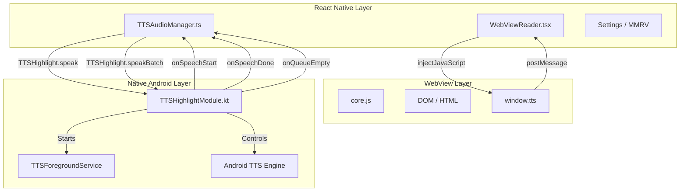
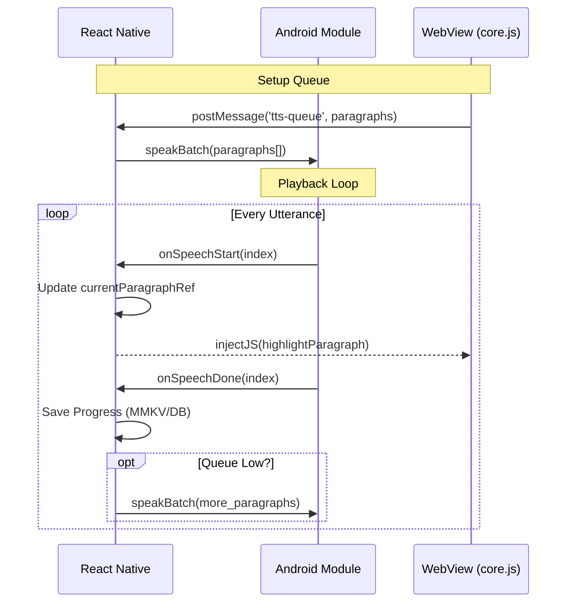
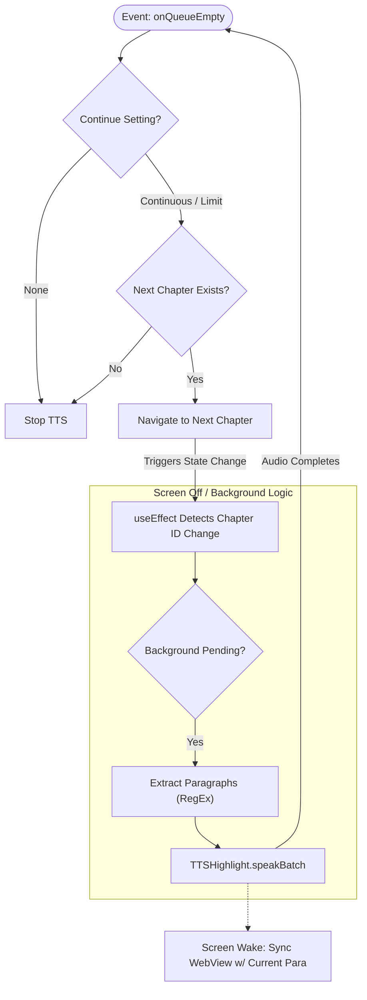

# TTS Design & Logic Analysis

## Overview

This document serves as the implementation anchor for the Text-to-Speech (TTS) functionality in LNReader. It details the architecture, logic flows, state management, and interaction between React Native, WebView, and the Native Android Layer.

## Architecture

The TTS system uses a hybrid architecture involving three layers:

1.  **React Native (Logic & Control)**:
    - Manages application state, settings, and UI.
    - Acts as the bridge between the WebView and the Native TTS Module.
    - Handles background playback queueing and chapter transitions.
2.  **WebView (Content & Visualization)**:
    - Renders the chapter content.
    - Parses the DOM to find readable text nodes (`core.js`).
    - Handles visual highlighting and scrolling.
    - Drives the "Foreground" playback loop.
3.  **Native Android (Audio & Background)**:
    - `TTSHighlightModule.kt`: Exposes system TTS engine to RN.
    - `TTSForegroundService.kt`: Keeps the app alive during background playback.
    - `UtteranceProgressListener`: Provides `onSpeechStart`, `onSpeechDone`, and `onRangeStart` events.

## Key Files

- **React Native**:
  - `src/screens/reader/components/WebViewReader.tsx`: Main controller.
  - `src/services/TTSAudioManager.ts`: JS wrapper for Native Module.
  - `src/screens/reader/components/ReaderBottomSheet/ReaderTTSTab.tsx`: TTS Settings UI.
- **WebView**:
  - `android/app/src/main/assets/js/core.js`: In-page logic (`window.reader`, `window.tts`).
- **Native**:
  - `android/app/src/main/java/com/rajarsheechatterjee/LNReader/TTSHighlightModule.kt`
  - `android/app/src/main/java/com/rajarsheechatterjee/LNReader/TTSForegroundService.kt`

## TTS Settings

There are **two** distinct locations where TTS settings can be configured. Both modify the same underlying persisted state (`useChapterGeneralSettings` / `useChapterReaderSettings`).

### 1. Main App Settings (Global)

Accessible via: `More` > `Settings` > `Reader` > `Accessibility` Tab.
This is the comprehensive configuration screen containing all available TTS options.

| Setting                        | Type   | Options / Range                      | Description                                                                                                                      |
| :----------------------------- | :----- | :----------------------------------- | :------------------------------------------------------------------------------------------------------------------------------- |
| **Text to Speech**             | Switch | On / Off                             | Master toggle for TTS functionality.                                                                                             |
| **Highlight paragraph**        | Switch | On / Off                             | Visually highlights the paragraph currently being spoken.                                                                        |
| **Background Playback**        | Switch | On / Off                             | **On (Default)**: Uses `speakBatch`. Audio continues in background. <br> **Off**: Uses `speak`. Stops when screen off/minimized. |
| **Auto Resume**                | Modal  | Always / Never / Ask                 | Controls behavior when opening a chapter with saved TTS progress.                                                                |
| **TTS Voice**                  | Modal  | System Voices                        | Selection of available Android system voices.                                                                                    |
| **Voice Speed**                | Slider | 0.1x - 3.0x                          | Playback rate.                                                                                                                   |
| **Voice Pitch**                | Slider | 0.1x - 2.0x                          | Audio pitch.                                                                                                                     |
| **Paused Scroll Behavior**     | Modal  | Ask / Auto-change / Never            | Action when user scrolls up _while paused_ (Manual Mode Prompt).                                                                 |
| **Playback Scroll Behavior**   | Modal  | Continue / Pause                     | Action when user scrolls _during_ playback.                                                                                      |
| **Continue to next chapter**   | Modal  | None / 5 / 10 / Continuous           | Auto-advance limit. 'None' stops at chapter end.                                                                                 |
| **Auto-reset future progress** | Modal  | Disabled / Reset Next / 5 / 10 / All | Resets read progress of future chapters when starting fresh.                                                                     |
| **Auto-download during TTS**   | Modal  | Disabled / @ 5 left / @ 10           | Triggers download of new chapters when queue gets low.                                                                           |
| **Chapters to download**       | Modal  | 5 / 10 / 15                          | Batch size for auto-downloads.                                                                                                   |

### 2. Reader In-Page Settings (Quick Access)

Accessible via: `Reader Bottom Sheet` > `TTS` Tab.
This provides quick access to the most frequently used settings while reading.

- **Enable Toggle**: Master switch.
- **Voice**: Quick selector.
- **Speed/Pitch**: Sliders.
- **Highlight Paragraph**: Toggle.
- **Background Playback**: Toggle.
- **Auto-Download**: Configuration.

> **Note**: Changes made in either location sync instantly to the other and apply immediately to the active reader session.

## Logic Flows

### 1. Initialization & Resume

When a user opens a chapter or presses "Play":

1.  **Check Saved Progress**: `WebViewReader` checks `savedParagraphIndex` (from DB) and `latestParagraphIndexRef` (memory/MMKV).
2.  **Resume Prompt**:
    - If a saved index exists (>0), `core.js` (`start()`) sends `type: 'request-tts-confirmation'` to RN.
    - RN shows `TTSResumeDialog`.
3.  **Confirmation**:
    - User confirms -> `handleResumeConfirm` -> calls `resumeTTS`.
    - `resumeTTS` injects `window.tts.restoreState({ shouldResume: true, paragraphIndex: ... })`.
    - `core.js` positions `currentElement` and calls `speak()`.

## Queue Management & Refill Strategy

To ensure uninterrupted playback during background mode, the system employs a proactive queue refill mechanism.

### Key Constants

- `REFILL_THRESHOLD`: **10** paragraphs. When the remaining queue drops below this, a refill is triggered.
- `MIN_BATCH_SIZE`: **20** paragraphs. The minimum number of paragraphs to fetch and add to the queue.
- `MAX_QUEUE_SIZE`: Implicitly limited by the chapter length and memory constraints.

### Refill Mechanics

1.  **Trigger**: `onSpeechDone` checks `queue.length - currentIndex < REFILL_THRESHOLD`.
2.  **Action**: `TTSAudioManager.refillQueue()` is called.
3.  **Source**: Fetches additional paragraphs from `htmlParagraphExtractor` (if available) or requests from WebView.
4.  **Synchronization**: `addToBatch` is used to append to the Native queue without stopping playback.
    - _Note_: This mitigates the risk of `onQueueEmpty` firing prematurely if the refill is fast enough.
    - _Race Condition_: If the queue runs dry _before_ the refill completes (e.g., short paragraphs), `onQueueEmpty` will fire. Logic exists to ignore this if a refill is `inProgress`.

### 2. Playback Loop (Foreground)

Used when `ttsBackgroundPlayback` is **OFF**.

1.  **Speak**: `core.js` finds text -> posts `speak` message -> RN calls `TTSHighlight.speak()`.
2.  **Done**: Native fires `onSpeechDone`.
3.  **Next**: RN listener receives event -> Injects `tts.next()` into WebView.
4.  **Find Next**: `core.js` (`next()`) traverses DOM for next text node.
5.  **Repeat**: Cycle continues.

### 3. Playback Loop (Background / Robust)

Used when `ttsBackgroundPlayback` is **ON** (Default).

1.  **Queue**: `core.js` analyzes upcoming paragraphs and sends `type: 'tts-queue'` to RN.
2.  **Batch Speak**: RN `WebViewReader` calls `TTSHighlight.speakBatch()` with multiple utterances.
3.  **Sync**:
    - Native fires `onSpeechStart` for each utterance.
    - RN listener updates `currentParagraphIndexRef`.
    - RN injects `window.tts.highlightParagraph()` and `window.tts.updateState()` to keep WebView UI synced (even if not driving audio).
4.  **Flow Control**: Audio transition is seamless (handled by Native queue). RN just keeps UI updated.

### 4. Highlighting

1.  **Paragraph**:
    - Triggered by `onSpeechStart`.
    - RN injects `window.tts.highlightParagraph(index)`.
    - `core.js` adds `.highlight` class and scrolls element into view.
2.  **Word/Range**:
    - Triggered by `onWordRange` (if supported by voice).
    - RN injects `window.tts.highlightRange(start, end)`.
    - `core.js` wraps text nodes in `.word-highlight` spans.

### 5. Scrolling Behavior

- **Auto-Scroll**:
  - `core.js` `scrollToElement` handles smooth scrolling to the active paragraph.
  - Sets `isAutoScrolling` flag to ignore scroll events during animation.
- **Manual Scroll**:
  - If user scrolls _during_ playback:
    - `processScroll`: Checks `isUserScrolling`.
    - **Backward Scroll**: If significant (> screen height), triggers "Manual Mode Prompt" (Stop TTS vs Continue).
    - **Forward Scroll**: Ignored (assumed "peeking").
    - **Progress Saving**: **BLOCKED** while TTS is reading to prevent overwriting TTS position with scroll position.

### 6. Background & Screen Off

1.  **Service**: `TTSForegroundService` keeps process alive.
2.  **WebView Handling**:
    - Android pauses WebView JS timers when screen is off.
    - Since RN drives the queue (Background Mode), audio continues even if WebView `core.js` is frozen.
    - `isWebViewSyncedRef` tracks if WebView has the correct chapter loaded.
3.  **Next Chapter (Screen Off)**:
    - Native queue finishes -> fires `onQueueEmpty`.
    - RN `onQueueEmpty` listener triggers `navigateChapter`.
    - `useEffect` on `chapter.id` detects change.
    - **Direct Extraction**: RN extracts paragraphs from the _new_ HTML (passed via props) using `extractParagraphs` (RegEx/Soup).
    - **Direct Playback**: RN calls `TTSHighlight.speakBatch` immediately without waiting for WebView to load/render.
4.  **Wake Up**:
    - When screen turns on, WebView reloads/refreshes.
    - `WebViewReader` detects mismatch (`prevChapterIdRef`) or waking state.
    - Syncs WebView UI to the current playing paragraph (`window.tts.updateState`).

### 7. Chapter Transitions

- **Foreground**: `core.js` reaches end -> `reader.post({type: 'next'})` -> RN navigates.
- **Background**: `onQueueEmpty` -> RN navigates -> RN starts new batch.

## State Management & Persistence

- **Progress**: Saved to Database (`ChapterQueries`) and MMKV (`chapter_progress_${id}`).
  - Updated on `onSpeechDone` (paragraph completion).
  - Blocked during manual scroll if TTS is active.
- **Refs**: `WebViewReader` uses `currentParagraphIndexRef` as the source of truth for "active" TTS position to survive re-renders.
- **Grace Periods**:
  - `wakeTransitionInProgressRef`: Ignores events during app wake-up.
  - `chapterTransitionTimeRef`: Ignores stale save events after chapter switch.

## TTS Dialogs & Popups

The system uses several modal dialogs to handle complex interactions, particularly around resuming and scrolling.

### 1. Resume Dialog (`TTSResumeDialog`)

- **Trigger**: Opening a chapter that has saved TTS progress (and `Auto Resume` setting is 'Ask').
- **Mechanism**:
  1.  `core.js` detects `savedParagraphIndex`.
  2.  Sends `type: 'request-tts-confirmation'`.
  3.  `WebViewReader` shows dialog.
- **Options**:
  - **Resume**: Calls `resumeTTS(savedIndex)` -> Injects `window.tts.restoreState`.
  - **Start from Top**: Injects `start()` (paragraph 0).
  - **Restart Chapter**: Reloads the entire chapter logic.

### 2. Manual Mode Dialog (`TTSManualModeDialog`)

- **Trigger**: User scrolls **BACKWARD** significantly (> 1 screen height) while TTS is **PAUSED**.
- **Mechanism**:
  1.  `core.js` `manualScrollListener` detects drag/scroll.
  2.  Calculates delta between `window.tts.currentElement` and visible area.
  3.  Sends `type: 'tts-manual-mode-prompt'`.
- **Options**:
  - **Stop TTS & Read Manually**: Calls `handleStopTTS` -> Stops audio -> UI switches to manual.
  - **Continue Following**: Calls `handleContinueFollowing` -> Injects `handleManualModeDialog('continue')` -> WebView scrolls back to TTS position.

### 3. Scroll Sync Dialog (`TTSScrollSyncDialog`)

- **Trigger**: User scrolls significantly while TTS is **PAUSED** (similar to Manual Mode but context-dependent on settings).
  - Specifically when `ttsScrollPrompt` is 'always-ask'.
- **Mechanism**:
  1.  `core.js` detects user is at Paragraph X but TTS is at Paragraph Y.
  2.  Sends `type: 'tts-scroll-prompt'`.
- **Options**:
  - **Continue from Here**: Updates TTS position to user's visible paragraph.
  - **Resume from Saved**: Jumps user back to original TTS position.

### 4. Sync Failure Dialog (`TTSSyncDialog`)

- **Trigger**: Critical failure during "Background Wake-up" synchronization.
  - Occurs if the App wakes up, tries to sync WebView to the playing chapter, but fails (e.g., chapter ID mismatch that cannot be resolved).
- **Mechanism**:

## Workflows & Diagrams

### 1. High-Level Architecture

Visualizes the control flow between React Native, the WebView (UI), and the Native Android Layer.



### 2. Initialization & Resume Flow

Logic determines where to start reading when a chapter is opened.

```mermaid
flowchart TD
    Start([Open Chapter]) --> CheckLast{Last TTS Chapter != Current?}
    CheckLast -- Yes --> CrossPrompt[Show Chapter Selection]
    CrossPrompt -- "Go Back" --> Nav[Navigate to Last Chapter] --> ResumeOld[Resume Old]
    CrossPrompt -- "Stay Here" --> Reset[Reset Future (opt)] --> CheckSaved

    CheckLast -- No --> CheckSaved{Saved Progress?}
    CheckSaved -- No --> StartTop[Start from Beginning]
    CheckSaved -- Yes --> CheckSetting{Auto Resume Setting}

    CheckSetting -- Always --> AutoResume[Auto Resume]
    CheckSetting -- Never --> StartTop
    CheckSetting -- Ask --> Dialog[Show TTSResumeDialog]

    Dialog -- User: 'Resume' --> AutoResume
    Dialog -- User: 'Restart' --> StartTop

    AutoResume --> Inject[Inject window.tts.restoreState]
    StartTop --> Start[Inject window.tts.start]

    Inject --> Speak[Native Speak / Batch]
    Start --> Speak
```

### 3. Background Playback Loop (Robust Mode)

The core loop that keeps TTS running smoothly in the background.



### 4. Chapter Transition (Background)

How the app handles moving to the next chapter when the screen is off.


