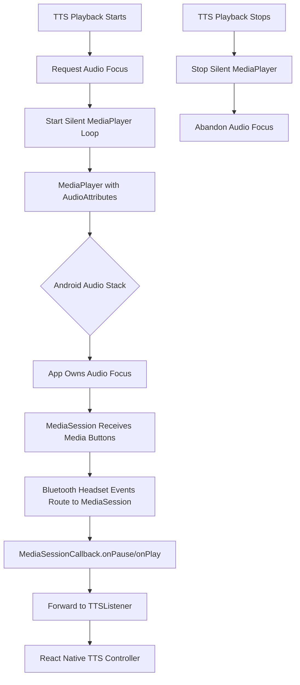

# Bluetooth Headset Support Architecture

## Objective
Enable reliable Play/Pause functionality for Text-to-Speech (TTS) using Bluetooth media controls (headsets, car audio, etc.) while maintaining the application's custom 6-button notification UI.

## The Problem

**Symptom:** Bluetooth headset buttons had no effect on TTS playback when device screen was off.

**Root Cause:** TTS audio is played by the system TTS engine (`com.google.android.tts`), not by our application. This causes our `MediaSession` to be "orphaned" from Android's audio stack:

```bash
# adb shell dumpsys media_session output:
Media button session is null  # ❌ Android doesn't know where to route media button events
LNReaderTTS ... active=true ... state=PLAYING(3)  # Session exists but orphaned
```

Android determines which app receives media button events based on which app currently "owns" audio focus. Since the system TTS service was playing the audio, Android didn't recognize our MediaSession as the active media player.

## The Solution: Silent Audio Workaround

### Strategy
Play a **silent looping audio file** using `MediaPlayer` with proper `AudioAttributes`. This establishes our app as the "audio focus owner," causing Android to route media button events to our `MediaSession`.

### Architecture Diagram



### Component Details

#### 1. Silent Audio File
- **Location:** `android/app/src/main/res/raw/silence.mp3`
- **Duration:** 0.5 seconds
- **Size:** ~2KB
- **Generated with:** `ffmpeg -f lavfi -i anullsrc=r=44100:cl=mono -t 0.5 -q:a 9 -acodec libmp3lame silence.mp3`

#### 2. `TTSForegroundService.kt` (Modified)

**Added instance variable:**
```kotlin
private var silentMediaPlayer: MediaPlayer? = null
```

**Start silent audio function:**
```kotlin
private fun startSilentAudioForMediaSession() {
    if (silentMediaPlayer != null) return
    
    try {
        silentMediaPlayer = MediaPlayer().apply {
            // CRITICAL: Set audio attributes BEFORE setting data source
            val audioAttributes = AudioAttributes.Builder()
                .setUsage(AudioAttributes.USAGE_MEDIA)      // Signal: This is media playback
                .setContentType(AudioAttributes.CONTENT_TYPE_MUSIC)  // Type: Music
                .build()
            setAudioAttributes(audioAttributes)
            
            // Load the silent audio resource
            val afd = resources.openRawResourceFd(R.raw.silence)
            if (afd != null) {
                setDataSource(afd.fileDescriptor, afd.startOffset, afd.length)
                afd.close()
                prepare()
                isLooping = true
                setVolume(0f, 0f)  // Silent
                start()
            }
        }
    } catch (e: Exception) {
        android.util.Log.e("TTS_DEBUG", "Failed to start silent audio: ${e.message}")
    }
}
```

**Stop silent audio function:**
```kotlin
private fun stopSilentAudio() {
    silentMediaPlayer?.let { player ->
        try {
            if (player.isPlaying) {
                player.stop()
            }
            player.release()
        } catch (e: Exception) {
            android.util.Log.e("TTS_DEBUG", "Failed to stop silent audio: ${e.message}")
        }
    }
    silentMediaPlayer = null
}
```

**Integration points:**
- `speakBatch()`: Call `startSilentAudioForMediaSession()` after `requestAudioFocus()`
- `stopTTS()`: Call `stopSilentAudio()` before `abandonAudioFocus()`
- `onDestroy()`: Call `stopSilentAudio()` for proper cleanup

#### 3. MediaSession Configuration (Unchanged)
The `MediaSessionCompat` remains configured as before:
- Created in `onCreate()`
- **NOT** attached to notification (preserves custom 6-button layout)
- Callbacks handle play/pause/next/prev actions
- Routes events to `TTSListener.onMediaAction()`

#### 4. React Native Integration (Unchanged)
- `TTSHighlightModule.kt` emits `onMediaAction` events to JS
- `useTTSController.ts` handles events and controls playback

### Why This Works

**Key Component: AudioAttributes**
```kotlin
AudioAttributes.Builder()
    .setUsage(AudioAttributes.USAGE_MEDIA)      // Tell Android: "This is media playback"
    .setContentType(AudioAttributes.CONTENT_TYPE_MUSIC)  // Type: Music
```

These attributes signal to Android that our app is actively playing media content. Combined with the looping MediaPlayer, this makes our app the audio focus owner.

**Result:**
```bash
# adb shell dumpsys media_session output after fix:
Media button session is com.rajarsheechatterjee.LNReader.debug/LNReaderTTS  ✅
```

### Trade-offs

**Pros:**
- ✅ Bluetooth media buttons work reliably
- ✅ Custom 6-button notification preserved
- ✅ No duplicate notifications
- ✅ Minimal code changes

**Cons:**
- Very slight battery impact (silent audio loop running during TTS)
- Adds ~2KB to APK size
- Slightly more complex than ideal

## Testing

### Correct Test Method
**Use the MediaSession dispatcher** (simulates real Bluetooth routing):
```bash
adb shell cmd media_session dispatch play-pause
adb shell cmd media_session dispatch play
adb shell cmd media_session dispatch pause
```

### Incorrect Test Method
**Do NOT use `adb shell input keyevent 85`** - this injects keys directly to the focused window, bypassing MediaSession routing entirely. Real Bluetooth headsets use the MediaSession system.

### Verification
```bash
# Check that our app is the media button session
adb shell dumpsys media_session | grep "Media button"
# Expected: Media button session is com.rajarsheechatterjee.LNReader.debug/LNReaderTTS
```

## Files Modified

| File                                                    | Purpose                                                                             |
| :------------------------------------------------------ | :---------------------------------------------------------------------------------- |
| `android/app/src/main/res/raw/silence.mp3`              | Silent audio file for establishing audio focus ownership (NEW)                      |
| `android/app/src/main/java/.../TTSForegroundService.kt` | Added `silentMediaPlayer`, `startSilentAudioForMediaSession()`, `stopSilentAudio()` |

## Production Deployment

Real Bluetooth headsets will work correctly because they use the MediaSession system, exactly like `cmd media_session dispatch` does.

**Test on real hardware** with actual Bluetooth headphones to confirm end-to-end functionality.
